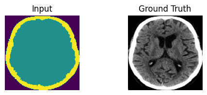
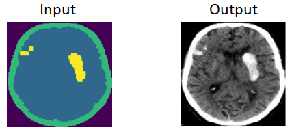
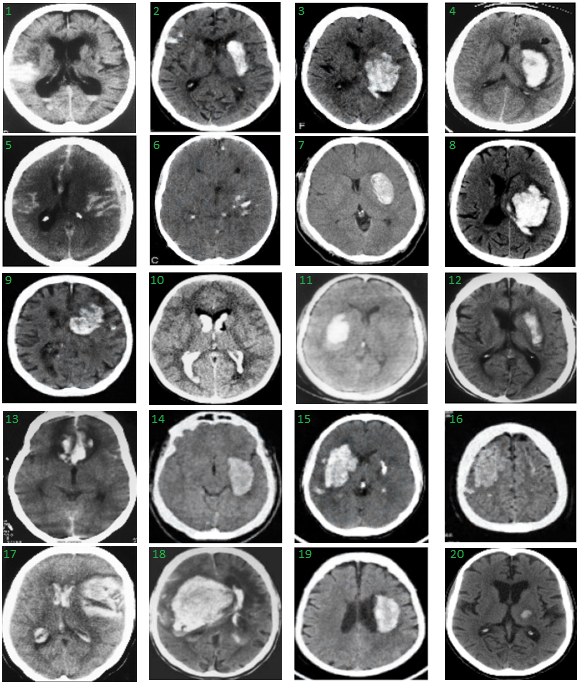

# Project Overview
This repository presents a method for augmenting medical image data in the context of computer vision tasks. Often, medical datasets lack sufficient representation of abnormal classes, making it challenging to train models effectively. The goal of this project was to develop a data augmentation method based on Generative Adversarial Networks (GANs) to create synthetic pathology images within real medical images. Experimental results suggest that the developed method can significantly improve the quality of medical image classification.

# Augmentation Method
The data augmentation method leverages the pix2pix architecture within a GAN framework and involves the following steps:

1. Image Segmentation: The initial step involves segmenting medical images, which is used to train the pix2pix network.
  

    
  <b> Training data for the pix2pix <b/>   
    

    
2. Matching Pathologies: Subsequently, for each image from the normal class, a corresponding pathology image is selected.

3. Generating Synthetic Images: The segmented images are combined and fed into the generative network. The network generates synthetic normal images with pathology.
  

    
  <b> Generated image based on merged images <b/>   
    

    
# Results and Comparisons
The project includes a comparative analysis of the method's performance in image classification tasks using the Adaboost algorithm and the ResNet-50 model. Statistical tests have shown the effectiveness of the developed medical data augmentation method.

# Visual Turing Test

      
  <b> Images of real and synthetic examples of pathology.    
    (Synthetic example indexes: 2,3,6,9,14,15,16,19)<b/>   

# Repository Structure
- augmentation.ipynb: A notebook containing the implementation of the developed augmentation method and the creation of a dataset with synthetic images.
- classification.ipynb: A notebook containing data preparation, the implementation of the Adaboost algorithm using ResNet-50, training on the training set, testing on the test set, and result storage.
- statistical_test.ipynb: A notebook containing result analysis using statistical tests such as paired t-test, Friedman test, Dunn's test.
